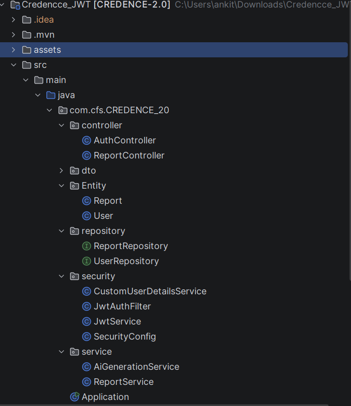
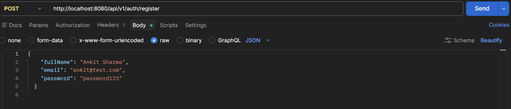
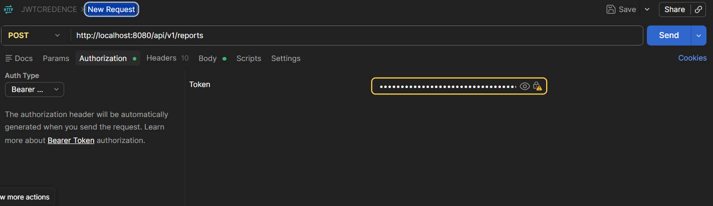
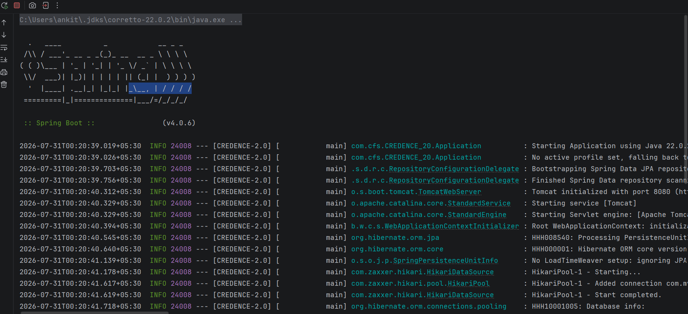
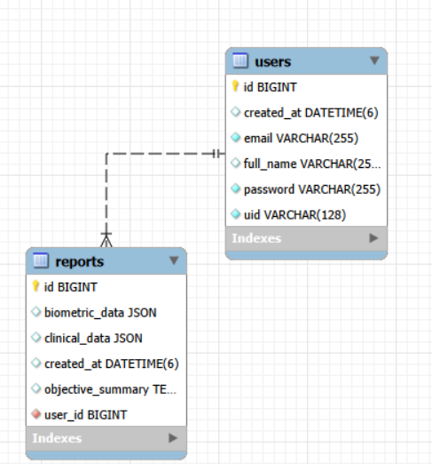

# 🏥 CREDENCE 2.0
### AI-Powered Clinical Report Generation System

> A secure Spring Boot backend application that converts patient conversations into structured clinical reports using Groq AI while protecting every endpoint with JWT Authentication and Spring Security.


---

# 📌 Table of Contents

- Project Overview
- Features
- Technology Stack
- System Architecture
- Workflow
- Project Structure
- Database Design
- Screenshots
- API Endpoints
- Installation
- Security
- Future Enhancements
- Author

---

# 🚀 Project Overview

CREDENCE 2.0 is a secure backend application developed using **Spring Boot**, **Spring Security**, **JWT Authentication**, **Hibernate**, and **MySQL**.

The system allows authenticated users to generate structured clinical reports manually or by sending patient conversations to **Groq AI**, which extracts medical information and returns organized clinical data.

The generated reports are securely stored in MySQL and are accessible only to their respective owners.

---

# ✨ Features

- 🔐 JWT Authentication
- 🛡 Spring Security Filter Chain
- 🔒 BCrypt Password Encryption
- 🤖 Groq AI Report Generation
- 📋 Manual Report Creation
- 📁 Per-user Report History
- 💾 MySQL Database Storage
- ⚡ REST APIs
- 📦 Maven Project
- 🏗 Layered Architecture
- 🔄 JSON-based Clinical & Biometric Data
- 👤 Secure User Authorization

---

# 💻 Technology Stack

| Technology | Purpose |
|------------|----------|
| Java 21 | Programming Language |
| Spring Boot | Backend Framework |
| Spring Security | Authentication & Authorization |
| JWT | Stateless Authentication |
| Hibernate / JPA | ORM |
| MySQL | Database |
| Maven | Dependency Management |
| Groq AI | AI Report Generation |
| IntelliJ IDEA | IDE |
| Postman | API Testing |

---

# 🏗 System Architecture

```text
                Client

                  │

                  ▼

         Spring Boot REST API

                  │

          Spring Security

          JWT Authentication

                  │

            Report Service

         ┌────────┴────────┐

         ▼                 ▼

     Groq AI            MySQL

         │                 │

         └──────► Clinical Report
```

---

# 🔄 Application Workflow

```text
User Registration

        │

User Login

        │

Receive JWT Token

        │

Bearer Token Authentication

        │

Generate Report

        │

Groq AI Processes Data

        │

Clinical Report Generated

        │

Save into MySQL

        │

Retrieve User Reports
```

---

# 📂 Project Structure

```text
src
 └── main
      ├── java
      │     └── com.cfs.CREDENCE_20
      │            ├── controller
      │            ├── dto
      │            ├── Entity
      │            ├── repository
      │            ├── security
      │            ├── service
      │            └── Application.java
      │
      └── resources
            └── application.properties
```

---

# 🗄 Database Design

- **Users Table**
  - id
  - full_name
  - email
  - password
  - uid
  - created_at

- **Reports Table**
  - id
  - clinical_data
  - biometric_data
  - objective_summary
  - created_at
  - user_id

Relationship

```
One User
      │
      │
      ▼
Many Reports
```

---

# 📸 Screenshots

## Overview


---

## Project Structure



---

## Register API



---

## JWT Authentication



---

## Application Running



---

## Database Schema



---

# 📮 REST API

## Authentication

| Method | Endpoint | Description |
|---------|----------|-------------|
| POST | /api/v1/auth/register | Register User |
| POST | /api/v1/auth/login | Login User |

---

## Reports

| Method | Endpoint |
|---------|----------|
| POST | /api/v1/reports |
| GET | /api/v1/reports |

---

# 🔐 Security

The application uses **Spring Security** with **JWT Authentication**.

Workflow

1. User registers.
2. Password stored using BCrypt.
3. User logs in.
4. JWT Token generated.
5. Client sends Bearer Token.
6. JWT Filter validates token.
7. Authorized request reaches Controller.
8. Data saved into MySQL.

---

# ⚙ Installation

Clone Repository

```bash
git clone https://github.com/Ankitraj1124/Credence-2.0.git
```

Move into project

```bash
cd Credence-2.0
```

Configure MySQL inside

```
application.properties
```

Run

```bash
mvn spring-boot:run
```

Application starts on

```
http://localhost:8080
```

---

# 🔮 Future Enhancements

- OAuth2 Authentication
- Refresh Tokens
- Docker Support
- Swagger Documentation
- Redis Token Blacklisting
- Email Verification
- CI/CD Pipeline
- Cloud Deployment

---

# 👨‍💻 Author

## Ankit Raj

**Java Backend Developer**

**Tech Stack**

- Java
- Spring Boot
- Spring Security
- JWT
- Hibernate
- MySQL
- REST APIs
- Groq AI

GitHub

https://github.com/Ankitraj1124

---

# ⭐ If you found this project useful, don't forget to Star the repository.ving it a **Star**.
